# Mothra-Text: User Decision Tree

This document describes the full set of choices a user makes when running mothra-text through the GUI. It maps directly to the CLI flags in `run_pipeline.py`, with some flags stripped (not useful to end clients) and others demoted to an **Advanced** panel.

---

## Flag mapping: GUI placement vs CLI

| CLI flag | GUI placement | Default |
|---|---|---|
| `--image` | Main — required upload | — |
| `--source-id` | Main (Cantus-aligned mode only) | — |
| `--folio` | Main (Cantus-aligned mode only) | — |
| `--column-count` | Main | Auto-detect |
| `--segmentation-model` | Main | Kraken built-in BLLA |
| `--recognition-model` | Main | Tridis Medieval/EarlyModern (auto-detected) |
| `--csv` | **Stripped** — not useful to end client | — |
| `--debug-ocr` | **Stripped** — internal only | — |
| `--stub-mode` | Advanced | off |
| `--device` | Advanced | cpu |
| `--padding` | Advanced | 15 px |
| `--skip-masking` | Advanced | off |
| `--column-bimodal-threshold` | Advanced | 0.5 |
| `--prev-folio-state` | Advanced | — |
| `--mothra-json` | Auto-provided by upstream step; pipeline runs without masking if unavailable | — |
| `--folio-state-out` | Auto-managed by pipeline | — |
| `--export-json` | Output panel — optional; creates a Pipeline Inspector JSON for result analysis | — |
| `--mei-json` | Auto-passed to MEI encoding stage; not user-facing | — |

---

## Decision tree

```mermaid
flowchart TD
    START([User opens Mothra GUI]) --> UPLOAD[1. Upload folio image\n.jpg / .png / .tiff]
    UPLOAD --> MODE{2. Alignment mode?}

    MODE -->|OCR-only\nno Cantus text| COL_COUNT
    MODE -->|Cantus-aligned\nNW text matching| CANTUS_ID

    CANTUS_ID[3a. Enter Cantus Source ID\ne.g. 601861] --> FOLIO_ID
    FOLIO_ID[3b. Enter folio identifier\ne.g. '005r'] --> COL_COUNT

    COL_COUNT{4. Column count?}
    COL_COUNT -->|Auto-detect default| SEG_MODEL
    COL_COUNT -->|Force 1 column| SEG_MODEL
    COL_COUNT -->|Force 2 columns| SEG_MODEL

    SEG_MODEL{5. Segmentation model?}
    SEG_MODEL -->|Default Kraken BLLA| OCR_MODEL
    SEG_MODEL -->|Upload custom\n.mlmodel or .safetensors| OCR_MODEL

    OCR_MODEL{6. OCR / Recognition model?}
    OCR_MODEL -->|Tridis Medieval/EarlyModern\nauto-detected default| ADV_GATE
    OCR_MODEL -->|Custom model\nHuggingFace ID or file| ADV_GATE

    ADV_GATE{7. Advanced options\nneeded?}
    ADV_GATE -->|No, use defaults| OUTPUT
    ADV_GATE -->|Yes, expand| ADV_OPTIONS

    ADV_OPTIONS["Skip OCR — stub mode\nMasking expansion — padding px slider\nSkip masking — bypass text-region masking\nColumn sensitivity — bimodal threshold slider 0–1\nPrevious folio state — JSON sidecar for chaining\nDevice — cpu / mps / gpu"]
    ADV_OPTIONS --> OUTPUT

    OUTPUT{8. Export Pipeline Inspector JSON?}
    OUTPUT -->|Yes — optional for analysis| RUN
    OUTPUT -->|No — MEI encoding only| RUN

    RUN([▶ Run Pipeline])

    RUN --> S0[Stage 0 · Text-region masking\nAuto-applied by upstream step\nSkipped silently if unavailable]
    S0 --> S1[Stage 1 · BLLA Line Segmentation]
    S1 --> S2[Stage 2 · Column Clustering + Reading Order]
    S2 --> S3[Stage 3 · HTR Text Recognition]
    S3 --> S4{Cantus-aligned?}
    S4 -->|Yes| S4A[Stage 4 · NW Chant Allocation\nFetch Cantus CSV · NW alignment · volpiano anchors]
    S4 -->|No| S5
    S4A --> S5[Stage 5 · Word Segmentation\nGT word count or OCR fallback]
    S5 --> S6[Stage 6 · Syllable Segmentation\nLatin syllabification]
    S6 --> EXPORT[Export JSON]
    EXPORT --> GUI([View in Pipeline Inspector GUI\nToggle: lines · words · syllables\nTeal = GT · Rose = fallback])
```

---

## Notes

**Text-region masking (automatic)** — An upstream step supplies a file marking which areas of the image are chant text vs music notation; the pipeline blacks out everything else before running line detection. This prevents Kraken from picking up neumes, staves, and decorative elements as text lines. If the upstream step does not return a result, masking is silently skipped and the pipeline runs on the full image.

**Masking expansion (`--padding`, default 15 px)** — Each marked text area is expanded by this many pixels in all directions before masking. Larger values help merge nearby word-level marks into full line strips but can bleed into adjacent music rows on densely packed pages. Reduce to ~10 px if neume rows are being incorrectly detected as text.

**Column count auto-detect** uses a bimodal coverage-profile histogram of the horizontal extent of all detected line polygons. The algorithm looks for a valley (gap between two columns) in the inner 20–80% of the text region. The Advanced sensitivity slider controls how deep that valley must be relative to the surrounding peaks — lower values require a deeper, cleaner gap.

**Force 2 columns** still runs the bimodal algorithm to locate the actual split position; it only skips the decision of whether to split.

**Custom segmentation models** accept Kraken `.mlmodel` (CoreML) or `.safetensors` format. The default is Kraken's built-in BLLA model. When a fine-tuned model trained on similar manuscript material is available, pass it via `--segmentation-model`. When using a model optimised for a specific column layout, pass `--column-count` alongside it.

**Skip OCR (stub mode)** still runs segmentation and produces word/syllable geometry — it just leaves text empty. Useful for geometry-only workflows or when no HTR model is available.

**Device (`--device`)** — `cpu` works everywhere; `mps` (Apple Silicon) or `cuda` (NVIDIA GPU) runs Kraken significantly faster when available.

**Multi-folio chaining** via previous folio state handles chants that cross a page break. `--folio-state-out` is auto-managed in the GUI; only supply `--prev-folio-state` manually when chaining consecutive folios from the command line.

For troubleshooting guidance and fuller explanations of each option, see [`user_guide.md`](user_guide.md).
